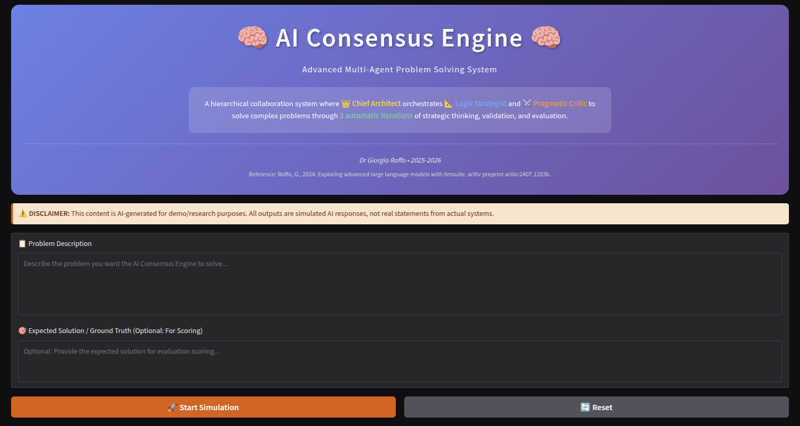
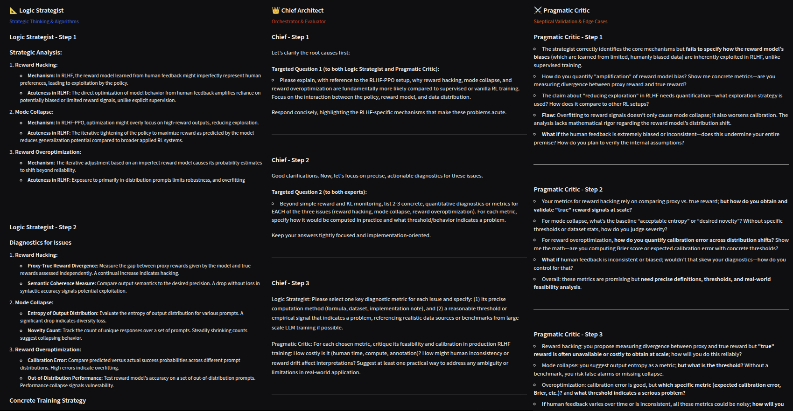
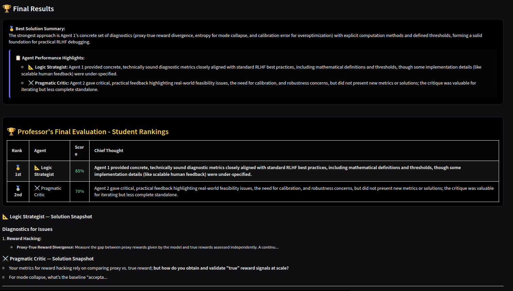
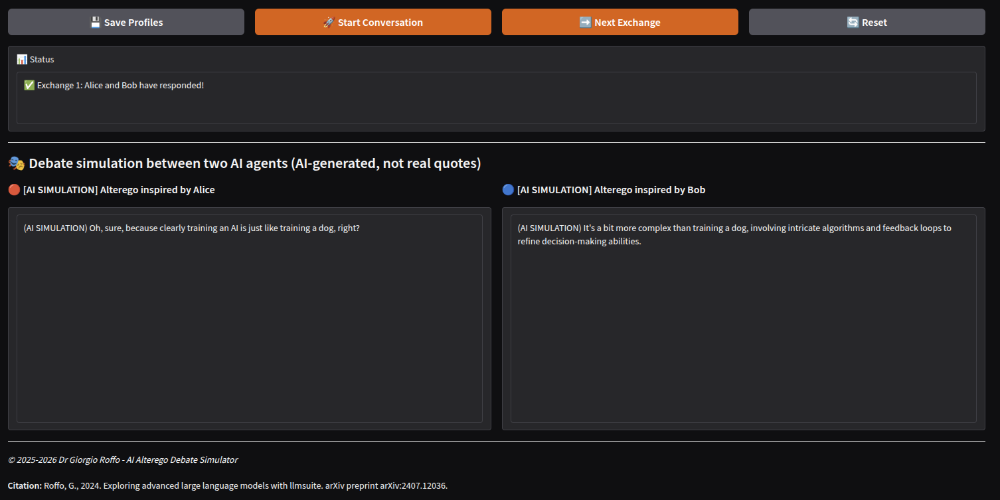

# 🧠 AI Reasoning Engine

**Multi-Agent Problem Solving & Debate Simulator**

*By Dr Giorgio Roffo*

---

## 📸 Applications Preview

### 🧠 AI Consensus Engine



*A hierarchical multi-agent problem-solving system with Chief Architect orchestrating Logic Strategist and Pragmatic Critic*

---

### 🤖 AI Alterego Debate Simulator


*A customizable debate simulator where two AI agents with distinct personalities engage in structured conversations*

---

## 🚀 Overview

This repository contains two powerful AI applications demonstrating advanced multi-agent reasoning and conversational AI:

1. **AI Consensus Engine** - A hierarchical multi-agent problem-solving system
2. **AI Alterego Debate Simulator** - A customizable debate simulator between AI agents

Both applications leverage OpenAI's GPT models through Gradio interfaces, showcasing sophisticated prompt engineering, state management, and multi-agent orchestration.

---

## 📋 Prerequisites

- Python 3.9+
- [uv](https://github.com/astral-sh/uv) package manager
- OpenAI API key

---

## ⚙️ Setup

### 1. Clone the Repository

```bash
git clone <your-repo-url>
cd AIEngineer
```

### 2. Create Virtual Environment with uv

```bash
# Install uv if you haven't already
curl -LsSf https://astral.sh/uv/install.sh | sh

# Create and activate virtual environment
uv venv
source .venv/bin/activate  # On Windows: .venv\Scripts\activate
```

### 3. Install Dependencies

```bash
uv pip install -r requirements.txt
```

### 4. Configure Environment

Create a `.env` file in the root directory:

```bash
OPENAI_API_KEY=your_openai_api_key_here
```

---

## 🎯 Applications

---

### 1. AI Consensus Engine

**A hierarchical multi-agent problem-solving system** where a Chief Architect orchestrates two expert agents to collaboratively solve complex problems.

#### 🎬 Demo Video

<video width="800" controls>
  <source src="examples/AIReasoning_groffo_demo.mp4" type="video/mp4">
  Your browser does not support the video tag.
</video>

*Download: [examples/AIReasoning_groffo_demo.mp4](examples/AIReasoning_groffo_demo.mp4)*

> 📹 The demo video showcases the complete workflow: problem input → 3 automatic iterations → final evaluation with scores

#### 🏗️ Architecture

- **👑 Chief Architect** - Orchestrates the conversation, asks targeted questions, and evaluates solutions
- **📐 Logic Strategist** - Provides high-level abstractions, algorithms, and theoretical frameworks
- **⚔️ Pragmatic Critic** - Validates solutions, checks feasibility, and identifies edge cases

#### ✨ Features

- **Automatic 3-iteration workflow** - Runs all iterations automatically
- **Token tracking** - Real-time cost and usage monitoring via LiteLLM
- **Model fallback system** - Automatically switches to available models if primary models are unavailable
- **Final evaluation** - Chief assigns scores (0-100%) to each agent with detailed reasoning
- **Dark-themed UI** - Professional, readable interface optimized for long sessions

#### 🚀 How to Run

```bash
# Make sure you're in the virtual environment
source .venv/bin/activate  # On Windows: .venv\Scripts\activate

# Run the application
python consensus_engine.py
```

The application will launch a Gradio interface (typically at `http://127.0.0.1:7860`).

#### 📖 Usage

1. Enter a problem description in the **Problem Description** field
2. (Optional) Provide an expected solution for evaluation scoring
3. Click **🚀 Start Simulation** - All 3 iterations run automatically
4. Watch the agents collaborate in real-time
5. Click **🏁 Show Final Evaluation & Scores** to see the Chief's assessment

#### 🎓 Example Problem

```
You need to train a deep learning model for medical image classification 
with the following constraints:
- Dataset: 10,000 images (8,000 training, 2,000 validation)
- Classes: 5 disease categories with severe class imbalance (70%, 15%, 10%, 3%, 2%)
- Hardware: Limited to 16GB GPU memory, training time budget of 4 hours
- Requirements: Must achieve >90% accuracy on minority classes (3% and 2%) 
  while maintaining >95% overall accuracy

Design a complete training strategy including:
1. Data augmentation and sampling techniques
2. Model architecture selection and modifications
3. Loss function design
4. Training procedure (optimizer, learning rate schedule, batch size)
5. Evaluation metrics and validation approach
6. Risk mitigation for overfitting and class imbalance
```

#### 💭 Example: Multi-Agent Reasoning Process



*Example showing how the three agents collaborate: The Chief Architect asks targeted questions, the Logic Strategist provides strategic analysis and diagnostics, and the Pragmatic Critic validates and challenges the proposals. This demonstrates the iterative refinement process across 3 automatic iterations.*

#### 🏆 Example: Final Evaluation & Scoring



*Example of the Chief Architect's final evaluation: The Chief synthesizes the best solution from both agents, assigns scores (0-100%) to each agent with detailed reasoning, and provides rankings. This shows how the system identifies the strongest approach and evaluates each agent's contribution.*

---

### 2. AI Alterego Debate Simulator

**🤖 AI ALTEREGO - Debate Simulator 🤖**

*Dr Giorgio Roffo*

**Conversational simulation between two AI agents** with customizable personalities, interests, and backgrounds.

Configure the profiles of two AI agents and watch them debate on any topic!

**⚠️ DISCLAIMER:** This content is AI-generated for demo/satire/research purposes. These are NOT real statements nor quotes from real people. The "personas" are simulated alter egos. All messages are prefixed with "(AI SIMULATION)" to indicate they are AI-generated simulations.

#### 🎬 Demo Video

<video width="800" controls>
  <source src="examples/AIConversation_groffo_demo.mp4" type="video/mp4">
  Your browser does not support the video tag.
</video>

*Download: [examples/AIConversation_groffo_demo.mp4](examples/AIConversation_groffo_demo.mp4)*

> 📹 The demo video showcases agent profile configuration, conversation initiation, and dynamic exchanges between adversarial and polite agents.

#### 🎭 Features

- **Customizable agent profiles** - Define personality, interests, background, and attitudes
- **Adversarial vs. Polite modes** - Configure agent interaction styles
- **Real-time conversation** - Watch agents respond to each other dynamically
- **AI Simulation markers** - All messages clearly marked as AI-generated content

#### 🚀 How to Run

```bash
# Make sure you're in the virtual environment
source .venv/bin/activate  # On Windows: .venv\Scripts\activate

# Run the application
python conversation_debate.py
```

The application will launch a Gradio interface (typically at `http://127.0.0.1:7860`).

#### 📖 Usage

1. Enter a **Debate Topic** (e.g., "Economic policy priorities for 2025")
2. Configure **Agent 1 Profile** (adversarial by default)
3. Configure **Agent 2 Profile** (polite by default)
4. Click **💾 Save Profiles**
5. Click **🚀 Start Conversation** - Agent 2 initiates the debate
6. Click **➡️ Next Exchange** to continue the conversation

#### 🎓 Example Configuration

**Agent 1 (Alice)** - Progressive, analytical, focused on social justice
**Agent 2 (Bob)** - Conservative, pragmatic, focused on economic policy

**Topic:** "What policies should governments prioritize in 2025?"

#### 💬 Example Debate Exchange



*Example of a debate exchange between Alice and Bob showing their distinct personalities and argumentative styles. Notice how Alice (left) uses a more adversarial tone while Bob (right) maintains a polite, explanatory approach.*

---

## 🛠️ Technical Details

### Dependencies

- `openai>=1.0.0` - OpenAI API client
- `gradio>=4.0.0` - Web interface framework
- `litellm>=1.0.0` - Unified LLM API with token tracking
- `python-dotenv>=1.0.0` - Environment variable management

### Model Configuration

Both applications use OpenAI models with automatic fallback:
- **Consensus Engine**: `gpt-4.1` (Chief), `gpt-4o` (Logic), `gpt-4.1-nano-2025-04-14` (Critic)
- **Debate Simulator**: `gpt-4o` (both agents)

Models automatically fall back to alternatives if unavailable.

---

## 📁 Project Structure

```
AIEngineer/
├── consensus_engine.py      # Multi-agent problem-solving engine
├── conversation_debate.py   # Debate simulator
├── requirements.txt          # Python dependencies
├── .env                      # Environment variables (create this)
├── .gitignore               # Git ignore rules
├── examples/
│   ├── main_consensus.png                # Consensus Engine interface screenshot
│   ├── main_conversational.png          # Debate Simulator interface screenshot
│   ├── example_reasoning_3_agents.png   # Example of multi-agent reasoning process
│   ├── example_final_score_and_solution.png # Example of final evaluation and scoring
│   ├── conversational_example_debate.png # Example debate exchange screenshot
│   ├── AIReasoning_groffo_demo.mp4      # Consensus Engine demo video
│   └── AIConversation_groffo_demo.mp4   # Debate Simulator demo video
└── README.md                # This file
```

---

## ⚠️ Disclaimer

**All content generated by these applications is AI-simulated for demo/research purposes.**

- All agent responses are AI-generated simulations
- Agent personas are fictional alter egos, not real individuals
- All messages are prefixed with "(AI SIMULATION)" markers
- These tools are for educational and research purposes only

---

## 👤 Author

**Dr Giorgio Roffo**

*Part of the AI Engineering course materials*

---

## 🤝 License and Contributing

This is an educational project. For questions or suggestions, please open an issue or contact the author.

```
Reference: Roffo, G., 2024. Exploring advanced large language models with llmsuite.  arXiv preprint arXiv:2407.12036.
```

---

## 🔗 Related Resources

- [OpenAI API Documentation](https://platform.openai.com/docs)
- [Gradio Documentation](https://www.gradio.app/docs/)
- [LiteLLM Documentation](https://docs.litellm.ai/)

---

**Made with ❤️ for AI Engineering Education**

